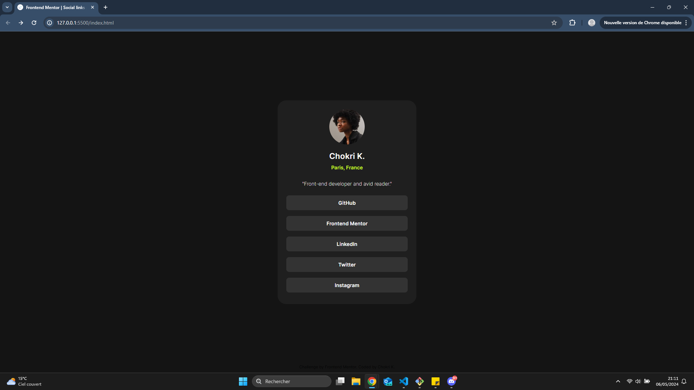

# Frontend Mentor - Social links profile solution - Chokri K.

This is a solution to the [Social links profile challenge on Frontend Mentor](https://www.frontendmentor.io/challenges/social-links-profile-UG32l9m6dQ). Frontend Mentor challenges help you improve your coding skills by building realistic projects.

**Thanks for your support !**

## Table of contents

- [Overview](#overview)
  - [The challenge](#the-challenge)
  - [Screenshot](#screenshot)
  - [Links](#links)
- [My process](#my-process)
  - [Built with](#built-with)
  - [What I learned](#what-i-learned)
  - [Continued development](#continued-development)
- [Author](#author)

**Note: Delete this note and update the table of contents based on what sections you keep.**

## Overview

### The challenge

Users should be able to:

- See hover and focus states for all interactive elements on the page

### Screenshot

### Links

- Live Site URL: [My solution here](https://social-profile-liard.vercel.app/)

## My process

### Built with

### What I learned

### Continued development

- Using an anchor within a div (and not just the text inside but the entire div becoming an anchor)

## Author

- Github - [@chokrikadoussi](https://github.com/chokrikadoussi)
- Frontend Mentor - [@chokrikadoussi](https://www.frontendmentor.io/profile/chokrikadoussi)
